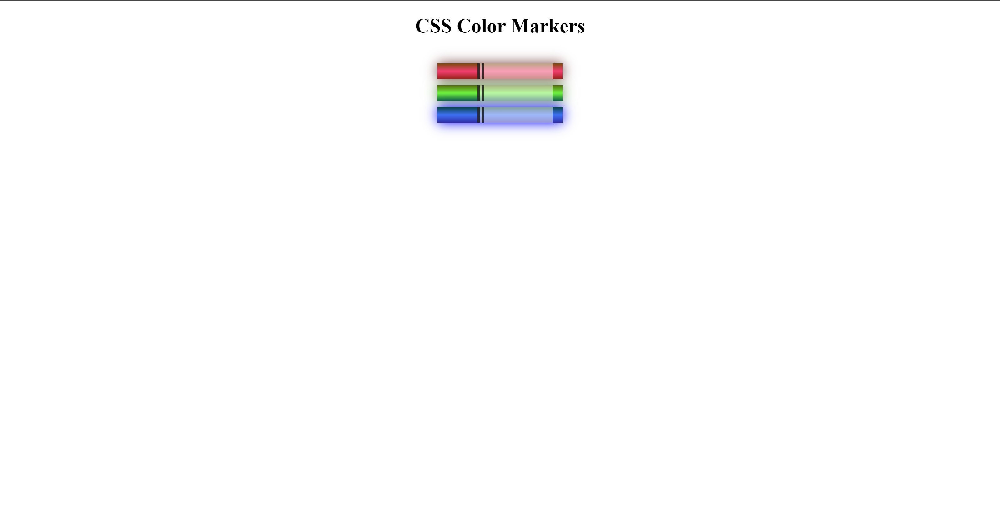

<h1>Colored Markers</h1>

A simple project showcasing colored marker elements using HTML and CSS.

<h2>Table of Contents</h2>
<ol>
    <li><a href="#introduction">Introduction</a></li>
    <li><a href="#project-structure">Project Structure</a></li>
    <li><a href="#features">Features</a></li>
    <li><a href="#getting-started">Getting Started</a></li>
        <ul>
            <li><a href="#prerequisites">Prerequisites</a></li>
            <li><a href="#installation">Installation</a></li>
        </ul>
    <li><a href="#usage">Usage</a></li>
    <li><a href="#contributing">Contributing</a></li>
    <li><a href="#preview">Preview</a></li>
    <li><a href="#contact-information">Contact Information</a></li>
    <li><a href="#credits">Credits</a></li>
    <li><a href="#license">License</a></li>
</ol>

<h2 id="introduction">Introduction</h2>

Colored Markers is a straightforward project designed to display various colored marker elements using HTML and CSS.

<h2 id="project-structure">Project Structure</h2>

The project structure is as follows:

<pre>
Colored Markers/
├── index.html
├── styles.css
└── README.md
</pre>

<h2 id="features">Features</h2>
<ul>
    <li><strong>Colorful Markers:</strong> Demonstrates different colored marker elements.</li>
    <li><strong>Simple Design:</strong> Easy-to-understand HTML and CSS structure.</li>
    <li><strong>Responsive:</strong> Adapts to various screen sizes.</li>
</ul>

<h2 id="getting-started">Getting Started</h2>
<h3 id="prerequisites">Prerequisites</h3>

To run this project, you need a web browser installed on your device.

<h3 id="installation">Installation</h3>
<ol>
    <li>Clone the repository:</li>
    <pre><code>git clone https://github.com/Yashi-Singh-1/Colored-Markers.git</code></pre>
    <li>Open the <code>index.html</code> file in your preferred web browser.</li>
</ol>

<h2 id="usage">Usage</h2>

To view the colored markers, open the <code>index.html</code> file in a web browser.

<h2 id="contributing">Contributing</h2>

Contributions are welcome! Feel free to open an issue or submit a pull request.

<h2 id="preview">Preview</h2>

<h2 id="contact-information">Contact Information</h2>

For any questions or feedback, please contact Yashi Singh via LinkedIn: www.linkedin.com/in/yashi-singh-b4143a246

<h2 id="credits">Credits</h2>

This project was inspired by [mention any sources or inspirations].

<h2 id="license">License</h2>

This project is licensed under the MIT License.

